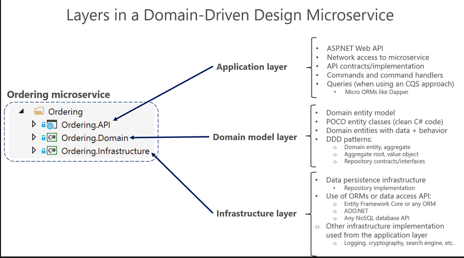

#  _DDD (*Domain Driver Development*)_

[O que é DDD](https://www.zup.com.br/blog/domain-driven-design-ddd)

## 1.0 Beneficios deste padrão de codigo
O DDD é um dos artefatos que pode auxiliar, principalmente, na comunicação entre o grupo de desenvolvimento e o grupo de profissionais especialistas no domínio do sistema. Com isso torna-se mais fácil o processo de levantamento de requisitos, que é fundamental para o planejamento do sistema.

## 2.0 Estrutura
A API é repartida em 3 partes, sendo elas:

Dominio -> Responsável por representar conceitos de negócios, informações sobre a situação de negócios e as regras de negócio. O estado que reflete a situação de negócios é controlado e usado aqui, embora os detalhes técnicos de armazená-lo sejam delegados à infraestrutura. Essa camada é a essência do software de negócios.

Infraestrutura -> É como todos os dados inicialmente mantidos em entidades (vindas da camada de dominio) são enviados, atualizados, ou mantidos em bancos de dados ou outro repositorio persistente. (utilizando algum ORM ou outro tipo de framework de acesso a dados).

Aplicação (Apresentação) -> Define os trabalhos que o software deve fazer e direciona os objetos de domínio expressivos para resolver problemas. As tarefas pelas quais esta camada é responsável são significativas para os negócios ou necessárias para a interação com as camadas do aplicativo de outros sistemas. Essa camada é mantida fina. Ele não contém regras de negócio nem conhecimento, mas apenas coordena o trabalho de tarefas e delegados para colaborações de objetos de domínio na próxima camada abaixo. Ele não tem um estado refletindo a situação de negócios, mas pode ter um estado que reflita o progresso de uma tarefa para o usuário ou o programa.

### 1.1 Domain (Domínio) -> Camada de entidades e negocio
É o coração do projeto e deve apresentar o negócio.  

Esta camada é expressa e codificada como uma biblioteca de classes, com as entidades que capturam dados mais comportamentos.

Deve ignorar totalmente detalhes relacionados a persistencia de dados. Esta camada não deve receber dependencias de nenhuma outra camada, é muito importante que classes declaradas nesta camada sejam _POCOs_.

Não deve possuir nenhuma dependencia direta, com nenhuma camada ou suas dependencias 

Neste podemos armazenar _repositories_ (incluindo suas interfaces), entidades (_*models*_) de maneira _POCO_, classes de serviços, Validações entre outros.

### 1.2 Infra (Infraestrutura) -> Camada de persistencia de dados
Cuida do suporte geral as demais implementações e em geral possui uma outra camada que se comunica com todas as camadas do projeto.

Esta camada, implementa e referencia a camada de dominio, para ter acesso as classes que nela estão presentes.

Neste criamos os _adapters_, _data contexts_, _providers_ e _queries_, Persistencias, Mapeamentos, Implementação dos _repositories_, outras implementações usadas na camada de apresentação, como _logging_, _criptografia_ entre outros.  

### 1.3 Presentation (Apresentação) -> Camada de Apresentação
Cuida da interação com que vai usar a aplicação.  

Basicamente, a “lógica de aplicativo” é onde você implementa todos os casos de uso que dependem de um determinado front-end. Por exemplo, a implementação relacionada a um serviço de API da Web.

Neste teremos acesso á um projeto Mobile, Web, Web API, Desktop entre outros.  

Podemos nele criar arquivos de configuração (swaggerGen, Controllers, Database-related, Middleware), Controllers em si, Middleware em si, Filtros entre outros.  

