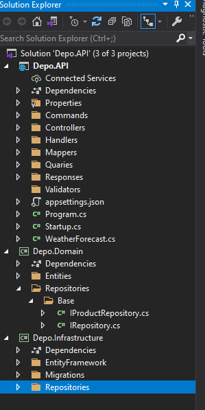

# C# _DDD (*Domain Driver Development*)_

[O que é DDD](https://www.zup.com.br/blog/domain-driven-design-ddd)

## 1.0 Estrutura
A API é repartida em 3 partes, sendo elas:

### 1.1 Domain (Domínio)
É o coração do projeto e deve apresentar o negócio.  

Neste podemos armazenar _repositories_ (incluindo suas interfaces), entidades (_*models*_), classes de serviços, Validações entre outros.

### 1.2 Infra (Infraestrutura)
Cuida do suporte geral as demais implementações e em geral possui uma outra camada que se comunica com todas as camadas do projeto.  

Neste criamos os _adapters_, _data contexts_, _providers_ e _queries_, Persistencias, Mapeamentos entre outros.  

### 1.3 Presentation (Apresentação)
Cuida da interação com que vai usar a aplicação.  

Neste teremos acesso á um projeto Mobile, Web, Web API, Desktop entre outros.  

Podemos nele criar arquivos de configuração (swaggerGen, Controllers, Database-related, Middleware), Controllers em si, Middleware em si, Filtros entre outros.  

