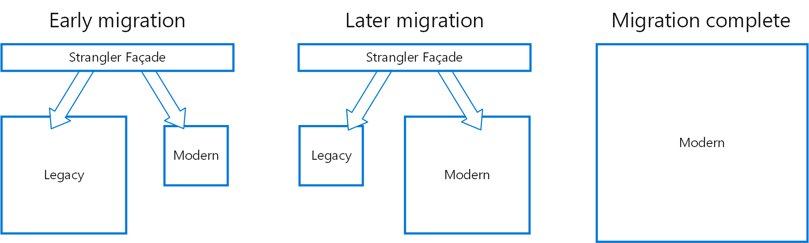

#  _*Microservices*_

É um estilo de arquitetura que estrutura uma aplicação como uma coleção de serviços que são:

- Independentes, e tem deploy separados.
- De baixo acoplamento.
- Organizados em torno de capacidades de negocio.

Serviços são tipicamente organizados baseados em capacidades de negocio. Cada serviço geralmente é mantido por um único ou pequeno grupo.

Permite uma organização entregar aplicações complexas, grandes, confiáveis e sustentáveis.

## Triangulo do sucesso

Entregas rápidas, frequentes, confiáveis e sustentáveis são uma combinação de 3 pilares, conhecidas como triangulo do sucesso, entre eles estão:

- Processo
    - DevOps, conforme definido pelo livro DevOps Handbook, que busca integrar o trabalho das equipes de desenvolvimento e operações, promovendo uma cultura de colaboração e responsabilidade compartilhada
- Organização
    - Uma rede de equipes pequenas, fracamente acopladas e multifuncionais
- Arquitetura
    - Uma arquitetura fracamente acoplada, testável e implantável

### Quando converter monolito para microserviços

Antes de considerar um refaturamento de todo uma estrutura monolítica, devemos ter certeza que estamos utilizando tudo que nossa arquitetura atual tem a nós oferecer, com as melhores praticas, dentre elas: Adoção de DevOps, reorganização do time em equipes menores e menos acopladas.

Em muitos casos, somente de adotarmos praticas melhores e utilizarmos o triangulo do sucesso, já conseguimos ter uma aplicação pouco acoplada, testável e de entre rápida e constante.

Mas as vezes uma aplicação após crescer muito, atinge um pico e rapidamente se torna um obstáculo. Isto tipicamente ocorre quando uma mesma aplicação monolítica está extremamente grande e complexa, além de ser mantida por um grupo muito grande, com deployment demorado, muitos problemas de merge, tecnologia ultrapassada entre outros problemas.

Em resumo, se sua aplicação está tendo problemas frequentes, por empecilhos, tecnologia ultrapassada, se você e sua equipe já tentaram todas as boas praticas para resolver seus problemas e ainda não adiantou e somente ali, migrar para microserviços seria uma boa escolha. No mundo atual aplicações devem ser performáticas, serem entregas de maneira rápida, frequente e de forma confiável. 

Uma forma mais secura de migrar para a nova arquitetura, seria começar a implementação dos novos serviços primeiro na nova arquitetura, visto que o processo de reestrutura pode demorar um bom tempo dependendo do tamanho de sua aplicação, e quão grande seu time que irá atuar nisto é.

Como visto na imagem acima, uma boa migração é dita pela forma que abordamos a mesma, começando gradativamente parando de atualizar o legado (monolítico) e adicionado as novas funcionalidades no moderno (microserviço) até que tudo que antes existia no legado, já está na nova aplicação, neste caso em serviços distintos, e ali teríamos nossa migração completa e bem sucedida. 

### Como migrar código existente para um serviço

> “***Everything shoud be made as simple as possible. But not simpler” - Albert Einstein***
> 

Serviços acima de tudo devem ser simples, fáceis de entender, desenvolver e testar.

Cada serviço deve ser bom em algo em especifico, por exemplo um microserviço de Fundos de Investimento, não poderíamos ter endpoints ou funcionalidades de ações por exemplo. Basicamente iremos abstrair de nosso monolito as funcionalidades e agrupa-las em módulos semelhantes, de tal forma que em um serviço tenha especialidade em um tema, também facilitando a distribuição de tarefas de desenvolvimento e manutenção de código, visto que cada desenvolvedor poderia atuar e focar em um modulo (serviço) específico sem que influencie em outros.

Cada serviço deve ser independente de outro, podemos ter casos onde um serviço chama outro para executar alguma tarefa, porém em questão de build, teste e deploy devem ser independentes.

### Benefícios

- Build mais rápida.
- Deploy mais rápido.
- Melhor manutenção.
- Permite utilização de diversas tecnologias.
- Escala separada, focando somente no que o serviço precisa.

### Nem tudo são flores

Microserviços trazem diversos beneficios, mas também ocorre um trade-off

- Comunicação entre serviços influenciável pela latência de rede, e limitado pela banda.
- A fase de teste pode se tornar um gargalo devido à dependência de outros serviços.
- Os microserviços são frequentemente implantados em ambientes multi-cloud, o que aumenta o risco e a perda de controle e visibilidade dos componentes da aplicação, resultando em pontos vulneráveis adicionais. A segurança de dados dentro de um framework baseado em microserviços também é uma preocupação proeminente.
- Em comparação com aplicativos monolíticos, as organizações enfrentam maior complexidade ao projetar microserviços. É preciso determinar o tamanho de cada microserviço, os pontos de conexão entre eles e o framework para integrá-los.

### Em resumo

- **O que são microserviços?**
    - São um estilo arquitetural que estrutura uma aplicação como uma coleção de serviços organizados em torno de capacidades de negócio, cada um com sua própria equipe e pipeline de implantação.
- **Por que usar microserviços?**
    - Eles permitem que uma organização entregue aplicações grandes e complexas de forma rápida, frequente, confiável e sustentável, o que é essencial para competir e vencer no mundo atual.
- **Como projetar uma arquitetura de microserviços?**
    - É preciso definir os serviços, suas responsabilidades, suas APIs e suas colaborações, usando um processo como o Assemblage e um guia de boas praticas seja em docs ou códigos de terceiros como referencia.
- **Como migrar de um monolito para microserviços?**
    - É recomendável fazer uma migração incremental usando o padrão Strangler Fig, evitando os anti-padrões de adoção de microserviços.

### Materiais de Referencia

- [Microservices.IO](https://microservices.io/post/architecture/2022/11/29/yow-london.html)
- [BMC](https://www.bmc.com/blogs/microservices-challenges-when-to-avoid/)
- [Medium](https://medium.com/microservices-architecture/what-are-the-challenges-in-microservices-architecture-2ee9149cfc4e)
- [IBM](https://www.ibm.com/downloads/cas/OQG4AJAM)
- [JavaTPoint](https://www.javatpoint.com/challenges-of-microservices-architecture)